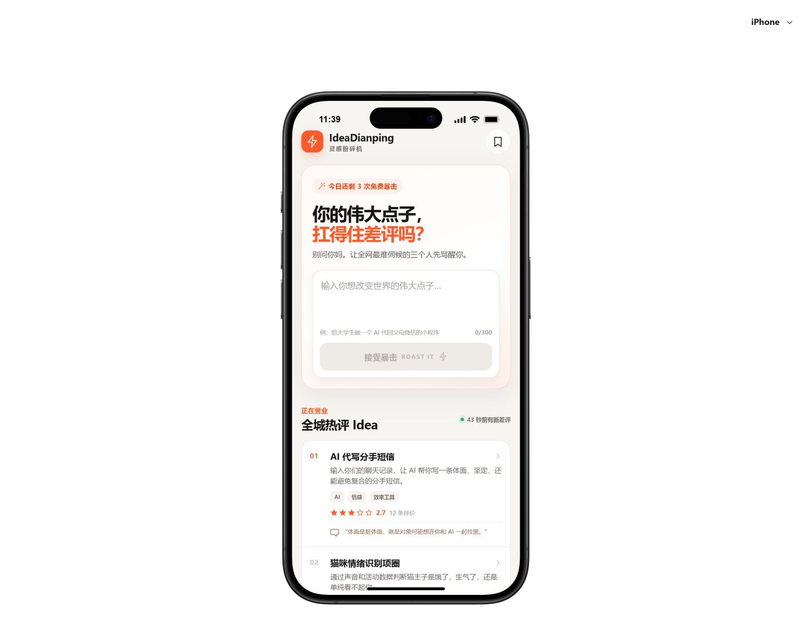

# IdeaDianping · 灵感粉碎机

把创业点子变成一家“店”，再让三位性格完全不同的 AI 探店博主从资本、工程和真实用户三个角度打分、毒评，并给出下一步真人验证任务。



## 这一版能做什么

- 在移动端首页输入 12–300 字的创业点子。
- 提交后进入店铺详情页，三张评论卡独立到达并实时更新平均分。
- 查看硅谷风投、暴躁程序员、00 后用户三种固定人格的结构化锐评。
- 点击 `@Idea 总结一下`，得到最终判词、三项共识风险和 48 小时真人验证任务。
- 将点子存入收藏夹或扔进垃圾桶；状态保存在当前浏览器的 `localStorage` 中。
- 打开六个预制热门 Idea，快速稳定地演示完整详情页。
- 在 iPhone 与 Pixel 10 设备框中预览；界面优先适配手机。

## DeepSeek 与数据存储

- 线上版本通过 Cloudflare Pages Functions 的 `/api/review` 和 `/api/summary` 调用 DeepSeek；API Key 只存在于 Cloudflare 的加密环境变量中，不会进入浏览器或 GitHub。
- 三位评论员并发、独立返回；失败的卡片可手动重试，不会自动产生额外调用。最终总结只在用户点击按钮后请求。
- 本地 `npm run dev` 默认使用快速 mock，方便零成本调试界面；`npm run build` 生成的线上版本会请求真实 API。
- 匿名用户的 Idea、评论、总结和收藏/垃圾桶状态保存在浏览器 `localStorage` 中。它比约 4 KB 上限的 Cookie 更适合保存这些结构化内容，但不会跨设备同步。

## Cloudflare Pages 部署

Cloudflare Pages 连接本仓库后使用以下设置：

```text
Build command: npm run build
Build output directory: dist/client
```

然后进入 `Workers & Pages → IdeaDianping → Settings → Variables and Secrets`，新增加密 Secret：

```text
DEEPSEEK_API_KEY=<你的 DeepSeek API Key>
```

如果 Preview 和 Production 都需要真实 AI，请分别为两个环境配置。保存后重新部署，Cloudflare 会自动发现仓库根目录下的 `functions/`。不要把真实 Key 写进 `.env`、`.dev.vars`、前端代码或 GitHub；`.env.example` 只提供变量名占位。

## 本地运行

需要 Node.js 20+。

```bash
npm install
npm run dev -- --host 0.0.0.0 --port 4173 --strictPort
```

浏览器打开 `http://localhost:4173/`。

## 验证命令

```bash
npm run check:runtime
npm run test:api
npm run build
npm run test:sites
```

## 主要文件

```text
src/Prototype.tsx              产品数据、页面、评论流与本地状态
src/prototype.css              移动端视觉与交互状态
functions/api/review.js        三位 AI 评论员的 Cloudflare 服务端接口
functions/api/summary.js       最终审判的 Cloudflare 服务端接口
tests/api-functions.test.mjs   API 请求格式、校验与密钥隔离测试
public/assets/reviewers/       三位固定评论员头像
IdeaDianping-MVP-Spec.md       产品、交互与技术规格
design-qa.md                   视觉与主流程验收记录
AGENTS.md                      移动端原型运行时约束
```

模板运行时文件负责手机设备框、状态栏、模拟键盘与滚动物理，业务开发优先修改 `src/Prototype.tsx` 和 `src/prototype.css`。

## 产品原则

IdeaDianping 不是市场调查，也不会输出虚假的“创业成功率”。它的目标是用有节目效果的方式快速暴露假设，并把娱乐性的锐评落到一个可以在 48 小时内执行的真人验证动作上。

完整背景、角色协议、异常策略与 24 小时排期见 [MVP Spec](./IdeaDianping-MVP-Spec.md)。
